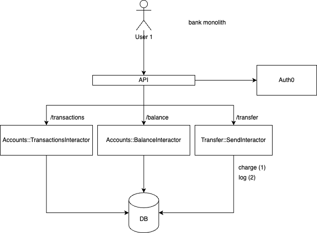
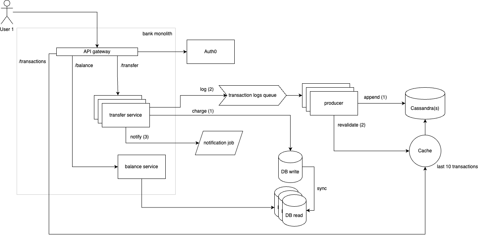

# README

## Rake/onboarding
```shell
rails user:create_admin # first is to create admin
rails user:create -- --email ... --name ... --password ... # next one user
rails credit:send -- --user <User.id or User.email> --amount 1500.3 # send money from admin account (rich one)
rails credit:send -- --user ada3@test.com --amount 1500.3 --force # directly w/o transaction logging
```

* I'm using Postgres on AWS RDS -- feel free to use it (but it's not super powerful)
* My Auth0 API limits is 1k tokens (but it's only using for manual user creation from rake task)
* My Auth0 users limit is 7k :shrug:


## Simplifications
1. Each client can have only one account
2. Limit-offset pagination for transactions and clients list -- but sometimes it's not relevant (depends on the business case)
3. In real money processing is good practice to split real number on two naturals (by decimal point) to avoid rounding

## Assumptions
1. Each client makes (on average) 5-10 transactions per day -- it's not a stock exchange :D
2. Deadlocks on transactions is possible, and not very often (see 1.)

## External services
1. For test purposes I'm using AWS RDS Postgres (you can use it too, I didn't hide credentials. It was done purposely for the test task)
2. For authenticating I'm using Auth0. Two reasons for this: you don't need to store sensitive data and I find these tools very useful either on the MVP stage and on the scale

## Scale
1. Instead of the "Transactions" table is better to use something write-optimized (NoSQL like Cassandra)
2. Make money swaps in an async way. In that way, we need:
    - 2.1 Create an additional transaction state, like 'processing'
    - 2.2 Make the Frontend to be able to show 'processing' transactions and receive some updates (via websocket for example)
3. Handle possible hard issue: outage between transaction commit and writing to transactions log DB (logging on very beginning of request)

## Solution
### MVP (current schema)


### Scale



## TODOs
* [x] constraints, indexes, not nulls
* [x] specs
* [x] ui
* [x] rake for user creation (+ admin)
* [x] rake for user credit
